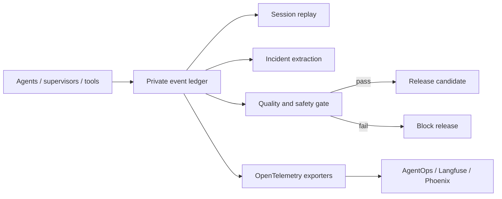

# AgentOps Layer

AgentOps converts monitoring events into operational decisions. It covers agent
lifecycle, tasks, handoffs, memory, model routing, token and cost, MCP tools,
performance, failures and retries, quality, security, and human approvals.



## Commands

```bash
scripts/control-tower agentops replay SESSION_ID
scripts/control-tower agentops incidents
scripts/control-tower agentops gate
scripts/control-tower agentops gate --strict
```

Replay returns a timestamp-ordered execution trail for one session. Incident
extraction returns failed, blocked, or terminated health, task, security, MCP,
and model events. The quality gate reports success rate, average quality and
grounding, error rate, P95 latency, cost per successful task, policy violations,
and number of correlated sessions.

Strict mode exits unsuccessfully when the gate fails, making it suitable for a
CI/CD release check. Defaults require at least 90% task success, 0.80 quality
and grounding, no more than 10% errors, P95 latency under ten seconds, cost per
successful task under $0.25, zero policy violations, and explicit quality and
security evidence. Tune these thresholds against representative evaluation
datasets before using them for a production release decision.

The local implementation does not require an external account. Optional
[AgentOps](https://github.com/AgentOps-AI/agentops), Langfuse, Phoenix, or other
OpenTelemetry-compatible backends can provide dashboards and richer trace
analysis. The [Azure AgentOps Accelerator](https://github.com/Azure/agentops)
is a separate reference for continuous evaluation and CI/CD patterns.

External export never replaces the local gate. If an exporter is unavailable,
the runtime keeps private local events and reports exporter health separately.
