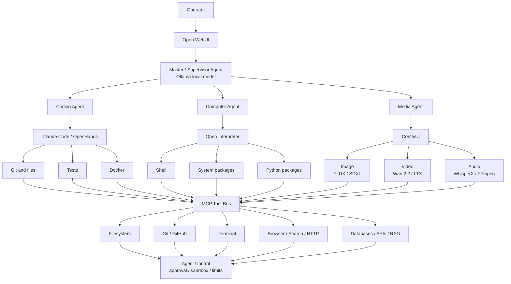

# Agent Control Tower

This is the target architecture for a local supervisor that delegates work to
specialized workers while keeping execution behind one policy boundary.



## Responsibilities

The supervisor plans work, selects a worker, applies token and model policy,
and combines results. It should not directly grant itself broader filesystem,
shell, network, or credential access.

Workers own narrow execution domains:

| Worker | Primary runtime | Allowed work |
|---|---|---|
| Coding | Claude Code or OpenHands | repositories, tests, builds, containers |
| Computer | Open Interpreter | shell and approved package operations |
| Media | ComfyUI and media CLIs | image, video, audio pipelines |

The MCP tool bus exposes capabilities through named, auditable interfaces.
Each tool declares its access scope, timeout, concurrency, and whether the
operation requires approval.

## Control sequence

1. Open WebUI sends the user request to the supervisor.
2. The supervisor classifies the request and chooses `fast`, `code`, or
   `strong` through LiteLLM.
3. The router delegates to one worker with a bounded task and token budget.
4. The worker requests tools through MCP.
5. Agent Control checks sandbox, path, network, resource, and approval policy.
6. Tool results return to the worker and then the supervisor.
7. The supervisor returns one result and records operational metrics without
   storing secrets or raw prompts in this repository.

## Operator controls

The included state engine provides durable controls for each agent:

```bash
scripts/control-tower agent create coder-1 --task "fix failing tests" --worker openhands
scripts/control-tower agent resume coder-1
scripts/control-tower agent pause coder-1
scripts/control-tower agent step coder-1
scripts/control-tower agent redirect coder-1 "only change the parser"
scripts/control-tower agent model coder-1 code
scripts/control-tower agent block-tool coder-1 filesystem.delete
scripts/control-tower agent kill coder-1
scripts/control-tower agent status coder-1
```

Agent records are written atomically with mode `0600` below
`~/.local/state/ollama-control-tower/agents`. Each record tracks status, worker,
model, instruction, token and cost use, steps, retry/reassignment counts,
per-agent tool blocks, MCP blocks, pending approval, and recent action
fingerprints.

The state machine supports `PAUSED`, `RUNNING`, `STEPPING`, `STOPPED`,
`KILLED`, `COMPLETED`, `BLOCKED`, and `HALTED`. Three identical consecutive
tool/state fingerprints trigger `HALTED`. Token use warns at 80%, selects the
fast model at 90%, and blocks at 100%; cost and step limits block at their cap.
The defaults and trust policy live in `config/agent-control.yaml`.

## Runtime adapter contract

The control plane records authoritative intent; the worker adapter enforces it.
An adapter for Claude Code, OpenHands, Open Interpreter, ComfyUI, or another
runtime must:

1. Poll the agent record before every model call and tool call.
2. Run work only in `RUNNING` or `STEPPING`.
3. Call `event` after each step with its token use, cost, tool name, and a
   stable state description.
4. Stop scheduling immediately on `BLOCKED` or `HALTED`.
5. Gracefully cancel on `STOPPED` and terminate the owned process tree on
   `KILLED`.
6. Execute one model/tool step in `STEPPING`; the event changes it to `PAUSED`.
7. Call `check-tool` before execution. Run `allow`, wait for operator review on
   `review`, and reject `block`.
8. Apply `instruction`, `model`, worker reassignment, and MCP/tool blocks before
   the next step, then report the applied revision in its event stream.

The adapter must own only the process group it started. This prevents a kill
command from terminating an editor, Ollama, or an unrelated user process.

## Policy boundary

The following actions should require explicit operator approval unless the
session already authorizes them:

- publishing, pushing, deploying, or sending external messages;
- installing or removing system packages;
- deleting data or replacing persistent configuration;
- exposing a loopback service to a LAN or the Internet;
- using credentials outside the provider or tool they belong to.

Resource limits apply independently of approval: model context, output tokens,
GPU residency, concurrent workers, subprocess duration, and storage usage stay
bounded by the Token Tower and worker configuration.

## Current implementation status

| Layer | Status in this repository |
|---|---|
| Ollama CUDA model server | implemented and validated |
| Cold-start prewarm | implemented and validated |
| Token Tower | implemented as policy configuration |
| LiteLLM aliases | implemented and validated |
| FreeLLMAPI bridge | configuration supplied; provider keys remain operator-owned |
| Open WebUI | compatible external frontend; deployment is outside this repository |
| Supervisor agent | architecture specified; orchestration runtime still to be selected |
| Coding/computer/media workers | integration contract specified; external runtimes not bundled |
| MCP tool bus | architecture specified; individual MCP servers remain separately managed |
| Agent state, budgets, loop halt, trust and tool policy | implemented and tested |
| Process pause/cancel/kill and action editing | adapter contract defined; each chosen worker runtime must implement it |
| Approval/sandbox enforcement | decisions implemented; tool execution enforcement belongs to the worker adapter |

Keeping status explicit prevents an architecture diagram from being mistaken
for proof that every external worker is installed or authorized.

Business roles and cross-functional workflows are defined separately in
[the Business Agent Map](BUSINESS_AGENT_MAP.md). The business registry selects
the responsible role; this control plane applies runtime state and safety policy.
Fleet telemetry, alert thresholds, and optional observability exporters are
defined in [the Agent Monitoring Tower](AGENT_MONITORING.md).
Runtime permissions, isolation, checkpoints, verification, and evidence gates
are defined in [the Agent Harness Manager](AGENT_HARNESS.md).
