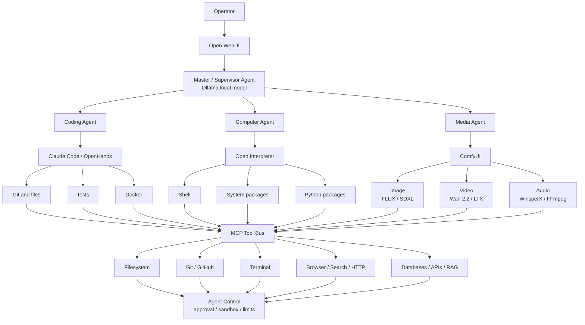

# Agent Control Tower

This is the target architecture for a local supervisor that delegates work to
specialized workers while keeping execution behind one policy boundary.

## Responsibilities

The supervisor plans work, selects a worker, applies token and model policy,
and combines results. It should not directly grant itself broader filesystem,
shell, network, or credential access.

Workers own narrow execution domains:

| Worker | Primary runtime | Allowed work |
|---|---|---|
| Coding | Claude Code or OpenHands | repositories, tests, builds, containers |
| Computer | Open Interpreter | shell and approved package operations |
| Media | ComfyUI and media CLIs | image, video, audio pipelines |

The MCP tool bus exposes capabilities through named, auditable interfaces.
Each tool declares its access scope, timeout, concurrency, and whether the
operation requires approval.

## Control sequence

1. Open WebUI sends the user request to the supervisor.
2. The supervisor classifies the request and chooses `fast`, `code`, or
   `strong` through LiteLLM.
3. The router delegates to one worker with a bounded task and token budget.
4. The worker requests tools through MCP.
5. Agent Control checks sandbox, path, network, resource, and approval policy.
6. Tool results return to the worker and then the supervisor.
7. The supervisor returns one result and records operational metrics without
   storing secrets or raw prompts in this repository.

## Policy boundary

The following actions should require explicit operator approval unless the
session already authorizes them:

- publishing, pushing, deploying, or sending external messages;
- installing or removing system packages;
- deleting data or replacing persistent configuration;
- exposing a loopback service to a LAN or the Internet;
- using credentials outside the provider or tool they belong to.

Resource limits apply independently of approval: model context, output tokens,
GPU residency, concurrent workers, subprocess duration, and storage usage stay
bounded by the Token Tower and worker configuration.

## Current implementation status

| Layer | Status in this repository |
|---|---|
| Ollama CUDA model server | implemented and validated |
| Cold-start prewarm | implemented and validated |
| Token Tower | implemented as policy configuration |
| LiteLLM aliases | implemented and validated |
| FreeLLMAPI bridge | configuration supplied; provider keys remain operator-owned |
| Open WebUI | compatible external frontend; deployment is outside this repository |
| Supervisor agent | architecture specified; orchestration runtime still to be selected |
| Coding/computer/media workers | integration contract specified; external runtimes not bundled |
| MCP tool bus | architecture specified; individual MCP servers remain separately managed |
| Approval/sandbox enforcement | policy specified; enforcement belongs to the chosen agent runtime |

Keeping status explicit prevents an architecture diagram from being mistaken
for proof that every external worker is installed or authorized.
