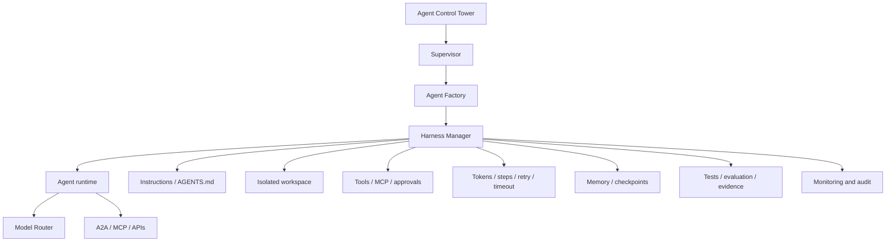

# Agent Harness Manager

The harness is the operating contract around an agent. The supervisor chooses
who works, the router chooses a model, the harness defines how that agent may
work, monitoring records what happened, and the Control Tower governs all of
those layers.



`config/harness-profiles.yaml` supplies coding, security, QA, data, and
production profiles. Each resolved profile includes isolation, instructions,
memory scope, file/shell/network access, tools, MCP servers, token and step
budgets, retries, timeout, checkpoints, approvals, and required evidence.

## Commands

```bash
scripts/control-tower harness validate
scripts/control-tower harness resolve security

scripts/control-tower harness create coding coder-1 "fix parser regression"
scripts/control-tower harness status run-0123456789ab
scripts/control-tower harness checkpoint run-0123456789ab \
  '{"step":10,"commit":"abc123","tests":"unit suite passed"}'
scripts/control-tower harness complete run-0123456789ab \
  '{"change_summary":"fixed parser","checks":"lint passed","diff":"reviewed","test_results":"12 passed"}'
```

Run manifests are atomically stored with mode `0600` below
`~/.local/state/ollama-control-tower/harness-runs`. A run cannot complete until
every evidence field required by its profile is present. Missing evidence moves
the run to `verification_failed`; an adapter may add evidence and resubmit.

## Runtime adapter contract

The current manager resolves and persists policy. A Codex, Claude Code,
OpenHands, Open Interpreter, or other runtime adapter must enforce it:

1. Create the declared worktree, container, or sandbox under the assigned path.
2. Load only declared instruction files, skills, memory scope, MCP servers, and
   tools.
3. Apply network, filesystem, shell, token, step, retry, and timeout limits.
4. Poll Agent Control before each model or tool step and emit Monitoring events.
5. Checkpoint at the configured interval and before risky actions.
6. Stop at approval gates without treating elapsed time as approval.
7. Run the required checks and submit concrete evidence for completion.
8. Preserve the run manifest and audit trail, then clean the isolated workspace
   according to retention policy.

The adapter must fail closed when a named tool, MCP server, instruction file,
or isolation mechanism is unavailable. It must never silently replace a denied
capability with a broader one.

## Profile boundaries

- **Coding:** repository read/write, shell, tests, Git and reviewed network.
- **Security:** repository read-only plus scanners; network denied.
- **QA:** read-only files, tests, Playwright and reviewed HTTP access.
- **Data:** bounded file writes, read-only SQL and pipeline validation.
- **Production:** deployment planning and observability reads; actual deployment
  stops for human approval and requires a rollback plan.

Forbidden capabilities such as disabling the sandbox or exporting credentials
cannot be granted by any profile.

## Engineering basis

The design follows the same reliability direction documented for Codex:
repository guidance in `AGENTS.md`, constrained sandbox and approval settings,
MCP for external systems, reusable skills, and explicit testing and review.
OpenAI's Symphony is a useful orchestration reference for isolated autonomous
implementation runs and proof of work. This repository implements its own
small policy contract; it does not bundle or claim API compatibility with
Symphony.
