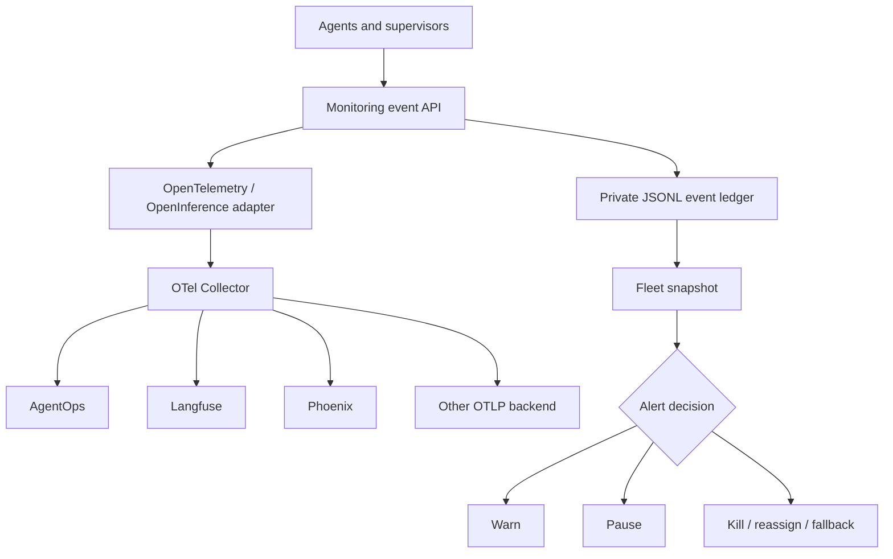

# Agent Monitoring Tower

The monitoring tower records one common event model for agents, sessions,
tasks, model calls, MCP tools, handoffs, memory operations, evaluations, and
security decisions. The local JSONL ledger remains useful without an external
service, while optional exporters can send the same telemetry to specialized
observability systems.



## Event model

Every event requires `agent_id`, `category`, `name`, and `status`. Optional
correlation fields include `session_id` and `task_id`. The supported categories
cover the complete monitoring map:

| Dimension | Example measurements |
|---|---|
| health | heartbeat, active, idle, blocked, terminated |
| task | queued, running, completed, failed |
| supervisor | delegations, rejections, escalations |
| a2a | handoffs, messages, latency, failures |
| mcp | tool calls, errors, server health |
| model | model, provider, outcome |
| tokens | input, output, cached, compressed |
| cost | agent, task, user and model cost |
| performance | P50, P95 and P99 latency |
| memory | reads, writes, growth, stale entries |
| quality | correctness, grounding and evaluation score |
| security | blocked actions, injection and policy violations |

The ledger defaults to
`~/.local/state/ollama-control-tower/monitor/events.jsonl`, uses file mode
`0600`, and redacts credential-shaped metadata keys recursively. Raw prompts and
raw tool arguments are disabled in `config/agent-monitoring.yaml`.

## Commands

Record an event from a runtime adapter:

```bash
scripts/control-tower monitor record '{
  "agent_id":"banking-fraud-01",
  "session_id":"session-42",
  "task_id":"case-918",
  "category":"model",
  "name":"fraud-assessment",
  "status":"completed",
  "model":"code",
  "input_tokens":850,
  "output_tokens":190,
  "cached_tokens":400,
  "compressed_tokens":220,
  "latency_ms":680,
  "cost_usd":0
}'
```

Read a 24-hour fleet snapshot or full health decision:

```bash
scripts/control-tower monitor snapshot
scripts/control-tower monitor snapshot --since-seconds 3600
scripts/control-tower monitor health
```

The snapshot reports agent count, status and category totals, tokens, cost,
latency percentiles, error rate, handoffs, tool calls, and policy violations.
The baseline alert policy warns at a 10% error rate or 10-second P95 latency,
pauses at a 25% error rate, and requests kill on a recorded security policy
violation. The Agent Control adapter performs the resulting action; monitoring
does not terminate processes directly.

## Backend roles

The backend entries are disabled until an operator explicitly configures and
starts them:

- [OpenTelemetry](https://github.com/open-telemetry/opentelemetry-collector)
  is the common transport and routing foundation.
- [AgentOps](https://github.com/AgentOps-AI/agentops) provides agent sessions,
  replay, multi-agent behavior, tool analytics, and agent-oriented cost views.
- [Langfuse](https://github.com/langfuse/langfuse) provides LLM traces,
  sessions, prompts, retrieval observations, and evaluations.
- [Arize Phoenix](https://github.com/Arize-ai/phoenix) provides OpenInference
  traces and deep RAG, tool, and evaluation debugging.
- [OpenLLMetry](https://github.com/traceloop/openllmetry) can instrument LLM,
  vector database, and framework calls and export standard telemetry.

Use OpenTelemetry trace and span IDs as the shared identifiers when enabling
more than one backend. Keep the Control Tower's agent, session, task, and
handoff IDs as span attributes so views across products describe the same run.

## Runtime adapter contract

Each agent runtime emits a task event at start and completion, one model event
per LLM call, one MCP event per tool call, and one A2A event per handoff. It
emits security events for both blocked and allowed high-impact attempts, memory
events for reads and writes, and quality events after evaluation. A heartbeat
must identify active, idle, blocked, failed, or terminated state.

Adapters must never include credentials, raw authorization headers, complete
prompt bodies, or unrestricted tool arguments. Export failures must not block
the agent's local control loop: retain the event locally, mark the exporter
unhealthy, and retry with bounded backoff.
