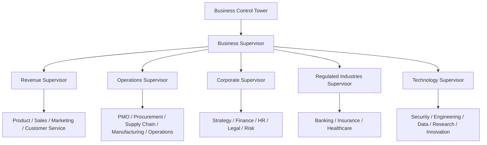
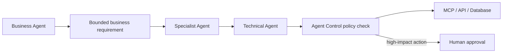

# Business Agent Map

The Business Control Tower organizes agents by business outcome. Business
agents decide what outcome is needed and prepare bounded requirements.
Specialist and technical agents decide how to execute the approved work through
allowed MCP tools, APIs, and databases.



Each registry entry resolves to five classifications:

```text
Domain → Department → Role → Skills → Tools
```

The source of truth is `config/business-agent-registry.yaml`. It contains 22
business functions, five supervisors, reusable tool profiles, technical-agent
boundaries, approval categories, and explicit cross-functional workflows.

## Delegation boundary



A business agent may define an outcome, gather requirements, analyze evidence,
and recommend an action. It cannot directly execute a privileged tool, bypass
an approval, or increase its own budget. A technical agent receives a bounded
task, checks the Agent Control state before every step, uses only allowed tools,
and returns evidence to the calling business agent.

Contract signatures, funds transfers, employment decisions, clinical and credit
decisions, production deployments, and destructive actions always stop at a
human approval gate. Healthcare agents prepare administrative work and draft
summaries; they do not make autonomous clinical decisions.

## Registry commands

Validate the complete map:

```bash
scripts/control-tower registry validate
```

List a department's resolved agents:

```bash
scripts/control-tower registry list --domain Banking
```

Inspect one role. A shared role such as `Contract Agent` can return entries for
more than one business domain:

```bash
scripts/control-tower registry show "Fraud Agent"
scripts/control-tower registry show "Contract Agent"
```

Inspect an ordered workflow and its approval gate:

```bash
scripts/control-tower registry workflow loan_processing
scripts/control-tower registry workflow sales_pipeline
```

## Execution chains

The regulated loan workflow is:

```text
Lending → KYC → AML → Fraud → Risk → Document → human credit decision
```

The sales workflow is:

```text
SDR → Account Executive → Proposal → Pricing → Contract → CRM
    → human contract signature
```

Workflow chains describe routing order. They do not grant tools or approval.
At execution time, the Agent Control Plane still applies trust, budget, tool,
MCP, pause, kill, and loop policies to every participating agent.

## Adding a business agent

Add the role under exactly one or more intentional domain entries. Supply the
domain's department, work, skills, and tool profile, then connect the domain to
a supervisor. Add high-impact outcomes to the approval list before placing the
role in a workflow. Run `registry validate` and the tests before publishing.

Duplicate role names are permitted because the resolved identity includes the
domain and department. Runtime agent IDs should include those components, for
example `banking-fraud-operations-fraud-agent-01`.
