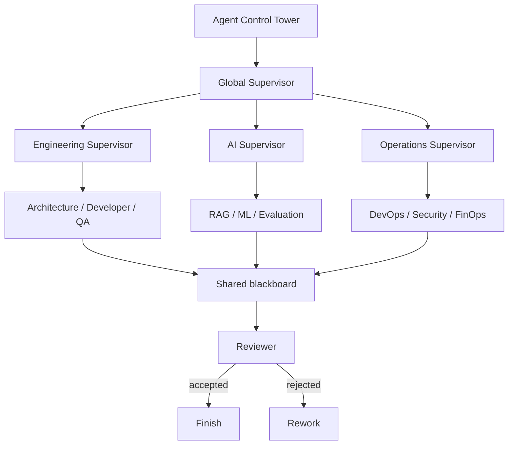

# Supervisor Tower

The Supervisor Tower converts a structured goal into a bounded dependency
graph, routes ready tasks to specialist agents, collects results in a shared
blackboard, and stops at deterministic review and approval gates.



The supervisor decides which agent receives each task, whether dependency-free
tasks can run in parallel, whether work retries, and when the plan reaches
review. The Harness Manager determines how each selected worker may operate.
Agent Control applies pause, kill, budget, and tool decisions. Monitoring
records delegations, handoffs, latency, errors, cost, and quality.

## Commands

```bash
scripts/control-tower supervisor validate

scripts/control-tower supervisor create "ship feature" '[
  {"id":"arch","agent":"Architect Agent","instruction":"design"},
  {"id":"code","agent":"Developer Agent","instruction":"build","depends_on":["arch"]},
  {"id":"test","agent":"QA Agent","instruction":"verify","depends_on":["code"]}
]'

scripts/control-tower supervisor next PLAN_ID
scripts/control-tower supervisor report PLAN_ID arch \
  '{"success":true,"tokens":500,"output":{"design":"approved"}}'
scripts/control-tower supervisor status PLAN_ID
scripts/control-tower supervisor approve PLAN_ID production_deployment
scripts/control-tower supervisor review PLAN_ID accept
```

`next` returns at most `max_parallel` ready tasks with resolved harness and model
routes. Runtime adapters execute those tasks and return structured reports.
Successful outputs enter the shared blackboard under their task ID, making
aggregation deterministic and traceable.

## Production controls

Plans reject unknown agents, dependencies, duplicate IDs, excessive delegation
depth, and dependency cycles before execution. Runtime controls bound steps,
tokens, cost, retries, handoffs, parallelism, no-progress attempts, and elapsed
time. A pending task with no satisfiable dependency path is marked deadlocked.
Failed tasks retry within policy and then fail the plan. All successful tasks
move the plan to reviewer state; only reviewer acceptance completes it.

The initial implementation schedules a supplied structured plan. Model-driven
decomposition belongs in a runtime adapter, which must submit its proposed plan
through the same validation path before any worker launches.

The original Python LangGraph Supervisor repository is now archived and its
maintainers recommend implementing the supervisor pattern directly with tools
for most use cases. This implementation therefore keeps its scheduler and state
contract framework-neutral while remaining compatible with LangGraph-style
handoffs.
