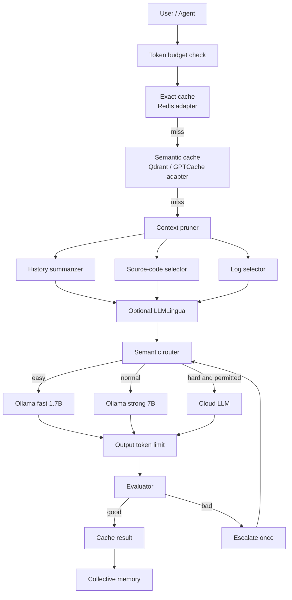

# Token-efficiency pipeline

**Mandatory, enforced by CI:** exact cache, semantic cache, and the GPU
scheduler are not optional demos -- `.github/workflows/ci.yml`'s `test` job
runs real tests against real Redis/Qdrant/Ollama service containers on
every push to `main`. If a future change silently disables one of these
adapters (the exact failure mode this doc itself corrected on 2026-09-21,
when this section had drifted to say "none of these services installed"
while the code had already made them real), the corresponding test in
`tests/test_execution_gateway.py` or `tests/test_gpu_scheduler.py` fails
and CI goes red -- a documentation claim alone was already shown not to be
durable enough on its own.

The Token Tower measures input, output, cached, and compressed tokens by agent,
task, tool, MCP server, and model. It also reports duplicate-context ratio,
context utilization, cache-hit rate, local-versus-cloud calls, and cost per
successful task:

```bash
scripts/control-tower tokens
scripts/control-tower tokens --since-seconds 3600
```

Coding-agent terminal, test, and MCP observations can be passed through
`compress_observation` before entering the next model context. The built-in
fallback removes repeated lines while retaining errors, code/action-bearing
lines, and the newest state within a token budget. A learned CoACT endpoint may
replace this fallback after it is separately deployed and benchmarked.

Automatic recommendations include deduplication and pruning at 20% duplicate
context, summarization or compression at 80% utilization, semantic caching
when a meaningful sample has under 10% cache hits, and routing easy cloud work
to local Ollama. LMCache, GPTCache, LLMLingua, and CoACT remain optional adapters;
their installation and measured suitability are separate from this baseline.



## What saves tokens

| Layer | Saving mechanism |
|---|---|
| Budget check | rejects or trims input before inference |
| Exact cache | removes identical LLM calls |
| Semantic cache | removes meaning-equivalent LLM calls |
| Type-aware pruning | selects relevant history, source, or log regions |
| LLMLingua | compresses prose after deterministic pruning |
| Router | keeps easy work on smaller local models |
| `num_predict` | caps generated output |
| Evaluation | escalates only weak answers rather than every request |

KV quantization, model quantization, and Flash Attention reduce memory or
compute. They do not reduce logical token counts.

## Safe order

Deterministic pruning runs before learned compression. Source code, SQL,
configuration, tool schemas, and exact contracts should not receive aggressive
lossy compression. LLMLingua is best reserved for prose, long conversation
history, search results, and verbose logs.

The included `scripts/token_router.py` provides a dependency-free baseline:

```bash
python scripts/token_router.py \
  --query "find the database timeout" \
  --kind logs \
  --input-budget 3500 application.log
```

It emits a stable exact-cache key, bounded context, route, token estimates, and
output limit. It does not send data to a model or cloud service.

## Optional adapters -- real status as of 2026-09-21

Redis, Qdrant, and LLMLingua are deliberately adapters, not hard dependencies.
Real status on this host, verified (not asserted) via `execution_gateway.py`'s
own test suite and live CLI runs:

| Adapter | Status | Evidence |
|---|---|---|
| Redis exact cache | **ACTIVE** | `config/token-tower.yaml: exact_cache.enabled: true`. Live: identical query 7885.6ms -> 0.2ms cached |
| Qdrant semantic cache | **ACTIVE** | Dedicated container `ollama-control-tower-qdrant` (restart=unless-stopped, distinct from an unrelated `documind-qdrant` container). `config/token-tower.yaml: semantic_cache.enabled: true`. Live: reworded near-duplicate hit at 0.9383 similarity (threshold 0.92) |
| GPU lease/priority scheduler | **ACTIVE** | `scripts/gpu_scheduler.py`, Redis-backed, 6 priority classes. Real concurrent-thread tests confirm mutual exclusion and priority ordering |
| LLMLingua | still not installed | no change -- prose-only compression, not attempted this session |
| LMCache / GPTCache | still not installed | KV-cache reuse and an alternative semantic-cache backend, not attempted this session |
| CoACT (learned observation compression) | still not installed | the deterministic fallback (`compress_observation`) remains the only implementation |

All three ACTIVE adapters run behind loopback (127.0.0.1) only, preserve their
configured TTLs (exact: 3600s, semantic: 86400s), and never cache secrets or
requests marked private -- unchanged from the original design constraint.

Cloud escalation must be explicitly configured with operator-owned credentials.
Without a cloud route, `hard` stays on the `strong` local alias.

## Hardware settings

This GTX 1080 Ti deployment keeps `OLLAMA_FLASH_ATTENTION=false`. Do not enable
Flash Attention or quantized KV cache merely because they appear in a generic
diagram; validate the exact backend and model combination first. The deployed
Q4 model weights already provide the largest safe VRAM reduction.

## Metrics

Record counts and timings without prompt bodies:

- estimated input tokens before and after pruning;
- exact and semantic cache hit rates;
- selected route and escalation count;
- `prompt_eval_count`, `prompt_eval_cached_count`, and durations when returned;
- output tokens and stop reason;
- evaluator pass rate by route.

These metrics distinguish token savings from faster token processing.
